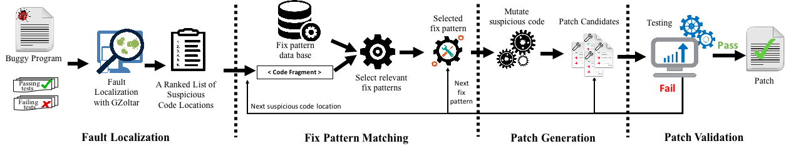

# AVATAR
Static Analysis Violation Fix Pattern based Automated Program Repair

AVATAR leverages the fix patterns of static analysis violations to fix semantic bugs.




This document describes how to use this tool and how to reproduce the result of our paper below. Please cite the following paper if you utilize the tool.

```
@inproceedings{liu2019avatar,
  Author = {Liu, Kui and Koyuncu, Anil and Kim, Dongsun and F. Bissyand{\'e}, Tegawend{\'e}},
  Title = {{AVATAR:} Fixing Semantic Bugs with Fix Patterns of Static Analysis Violations},
  Booktitle = {Proceedings of the 26th IEEE International Conference on Software Analysis, Evolution, and Reengineering},
  pages={456--467},
  year={2019},
  organization={IEEE}
}
```

I. Requirement
--------------
 - Java 1.7
 - [Defects4J](https://github.com/rjust/defects4j)
 - GZoltar 0.1.1
 
 
 II. Run AVATAR
 --------------
 1. Clone the PatchParser:
  - `git clone https://github.com/SerVal-DTF/AVATAR.git`
  
2. Compile this project.
  - `./compile.sh`
  
3. Fix bugs with perfect fault localization, which means that the bug positions at line level are known and the fault localization technique is not needed. 
  - `./LineFix.sh <BugID>`

4. Fix bugs with restricted fault localization, which means that the bug positions at method level are known that will help increase the accuracy of fault localization.
  - `./MethodFix.sh <BugID>`
  
5. Fix bugs with normal fault localization, which means that AVATAR directly uses off-the-shelf fault localization techniques (such as GZoltar + Ochiai) to localize the faulty code positions.
  - `./FLFix.sh <BugID>`